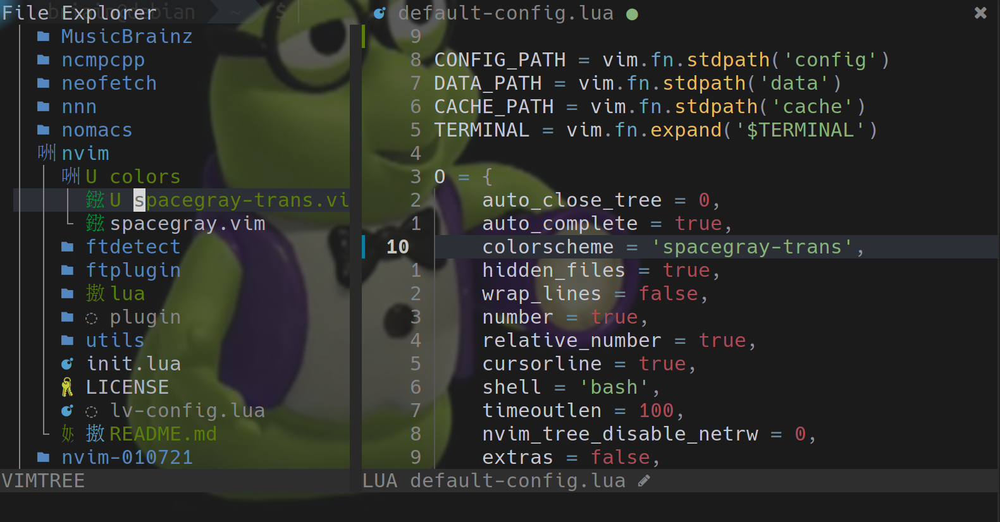

# spacegray-trans.vim

This is a transparent colorscheme for LunarVim.

Spacegray is the best colorscheme for LunarVim so far, especially because the comments are not too faint.  However, I was looking for one with a transparent background, so I created spacegray-trans. Works very good with background wallpaper slideshow!

https://github.com/ChristianChiarulli is the creator of both LunarVim and Spacegray.vim
